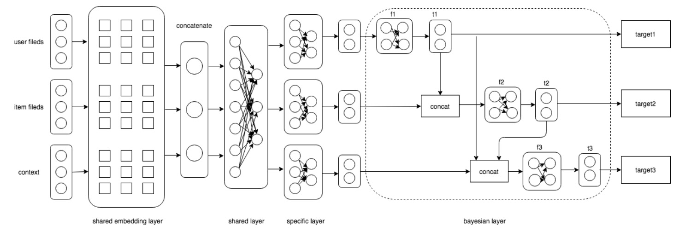

# DBMTL

### 简介

DBMTL构建了多个目标之间的贝叶斯网络，显式建模了多个目标之间可能存在的因果关系，通过对不同任务间的贝叶斯关系来同时优化场景中的多个指标。


底层的shared layer和specific layer是通过hard parameter sharing方式来人工配置的，而google的MMoE是基于soft parameter sharing来实现不同任务底层特征和网络共享，并在Youtube场景中取得了不错的效果。因此DBMTL同样支持将shared layer和specific layer模块替换成MMoE模块，即通过task gate的方式在多组expert参数中加权组合出对应task的feature。


### 配置说明

#### DBTML

```protobuf
model_config {
  model_class: "DBMTL"
  feature_groups {
    group_name: "all"
    feature_names: "user_id"
    feature_names: "cms_segid"
    ...
    feature_names: "tag_brand_list"
    wide_deep: DEEP
  }
  dbmtl {
    bottom_dnn {
      hidden_units: [1024, 512, 256]
    }
    task_towers {
      tower_name: "ctr"
      label_name: "clk"
      loss_type: CLASSIFICATION
      metrics_set: {
        auc {}
      }
      dnn {
        hidden_units: [256, 128, 64, 32]
      }
      relation_dnn {
        hidden_units: [32]
      }
      weight: 1.0
    }
    task_towers {
      tower_name: "cvr"
      label_name: "buy"
      loss_type: CLASSIFICATION
      metrics_set: {
        auc {}
      }
      dnn {
        hidden_units: [256, 128, 64, 32]
      }
      relation_tower_names: ["ctr"]
      relation_dnn {
        hidden_units: [32]
      }
      weight: 1.0
    }
    l2_regularization: 1e-6
  }
  embedding_regularization: 5e-6
}
```

- model\_class: 'DBMTL', 不需要修改
- feature\_groups: 配置一个名为'all'的feature\_group。
- dbmtl: dbmtl相关的参数
  - experts
    - expert\_name
    - dnn deep part的参数配置
      - hidden\_units: dnn每一层的channel数目，即神经元的数目
  - task\_towers 根据任务数配置task\_towers
    - tower\_name
    - dnn deep part的参数配置
      - hidden\_units: dnn每一层的channel数目，即神经元的数目
    - 默认为二分类任务，即num\_class默认为1，weight默认为1.0，loss\_type默认为CLASSIFICATION，metrics\_set为auc
    - 注：label\_fields需与task\_towers一一对齐。
  - embedding\_regularization: 对embedding部分加regularization，防止overfit

#### DBMTL+MMOE

```protobuf
model_config {
  model_class: "DBMTL"
  feature_groups {
    group_name: "all"
    feature_names: "user_id"
    feature_names: "cms_segid"
    ...
    feature_names: "tag_brand_list"
    wide_deep: DEEP
  }
  dbmtl {
    bottom_dnn {
      hidden_units: [1024]
    }
    expert_dnn {
      hidden_units: [256, 128, 64, 32]
    }
    num_expert: 8
    task_towers {
      tower_name: "ctr"
      label_name: "clk"
      loss_type: CLASSIFICATION
      metrics_set: {
        auc {}
      }
      dnn {
        hidden_units: [256, 128, 64, 32]
      }
      relation_dnn {
        hidden_units: [32]
      }
      weight: 1.0
    }
    task_towers {
      tower_name: "cvr"
      label_name: "buy"
      loss_type: CLASSIFICATION
      metrics_set: {
        auc {}
      }
      dnn {
        hidden_units: [256, 128, 64, 32]
      }
      relation_tower_names: ["ctr"]
      relation_dnn {
        hidden_units: [32]
      }
      weight: 1.0
    }
    l2_regularization: 1e-6
  }
  embedding_regularization: 5e-6
}
```

- dbmtl
  - expert\_dnn: MMOE的专家DNN配置
    - hidden\_units: dnn每一层的channel数目，即神经元的数目
  - expert\_num: 专家DNN的数目
  - 其余与dbmtl一致

### 示例Config

- [DBMTL\_demo.config](https://easy-rec.oss-cn-hangzhou.aliyuncs.com/config/dbmtl.config)
- [DBMTL\_MMOE\_demo.config](https://easy-rec.oss-cn-hangzhou.aliyuncs.com/config/dbmtl_mmoe.config)

### 参考论文

[DBMTL](https://dl.acm.org/doi/pdf/10.1145/3219819.3220007)
