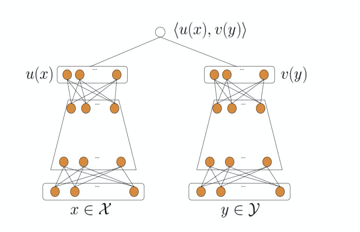

# DSSM

### 简介

双塔召回模型，分为user塔和item塔。
注：使用时需指定user id和item id。


### 配置说明

```protobuf
model_config:{
  model_class: "DSSM"
  feature_groups: {
    group_name: 'user'
    feature_names: 'user_id'
    feature_names: 'cms_segid'
    ...
    feature_names: 'tag_brand_list'
    wide_deep:DEEP
  }
  feature_groups: {
    group_name: "item"
    feature_names: 'adgroup_id'
    feature_names: 'cate_id'
    ...
    feature_names: 'pid'
    wide_deep:DEEP
  }
  dssm {
    user_tower {
      id: "user_id"
      dnn {
        hidden_units: [256, 128, 64, 32]
        # dropout_ratio : [0.1, 0.1, 0.1, 0.1]
      }
    }
    item_tower {
      id: "adgroup_id"
      dnn {
        hidden_units: [256, 128, 64, 32]
      }
    }
    l2_regularization: 1e-6
  }
  embedding_regularization: 5e-5
}
```

- model\_class: 'DSSM', 不需要修改
- feature\_groups: 需要两个feature\_group: user和item, **group name不能变**
- dssm: dssm相关的参数，必须配置user\_tower和item\_tower
- user\_tower/item\_tower:
  - dnn: deep part的参数配置
    - hidden\_units: dnn每一层的channel数目，即神经元的数目
  - id: 指定user\_id/item\_id列
- embedding\_regularization: 对embedding部分加regularization，防止overfit

### 示例Config

[DSSM\_demo.config](https://easy-rec.oss-cn-hangzhou.aliyuncs.com/config/dssm.config)

### 参考论文

[DSSM.pdf](https://www.microsoft.com/en-us/research/wp-content/uploads/2016/02/cikm2013_DSSM_fullversion.pdf)
